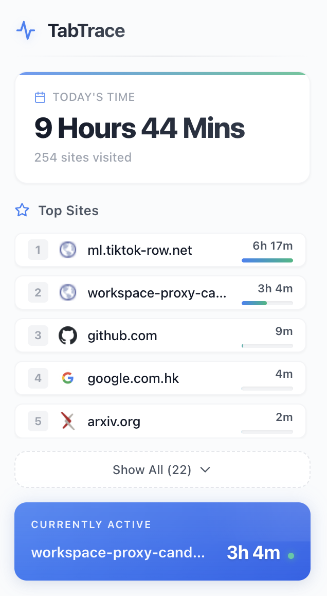

# TabTrace

> 📖 Also available in [中文版](README_zh.md)

A lightweight Chrome extension that tracks your browsing time and displays comprehensive usage statistics.



## Features

- **Today's browsing time** - See how much time you've spent browsing today in real-time
- **Top sites ranking** - View your most visited sites ranked by time spent, with beautiful progress bars
- **Current tab tracking** - Real-time tracking of your active tab with live duration updates
- **Expandable site list** - Show top 5 sites by default, with option to expand and see all visited sites
- **Historical data** - View browsing history by week, month, or year with aggregated statistics
- **Favicon display** - Beautiful favicon icons for each site via Google Favicon API
- **Local data storage** - All data stored locally in Chrome, no external transmission
- **Beijing Time (UTC+8)** - All date calculations use Beijing time as the standard

## Installation

1. Clone this repository
2. Open `chrome://extensions/`
3. Enable **Developer mode** (toggle in top right)
4. Click **Load unpacked**
5. Select the `TabTrace` folder

## Usage

Once installed, click the TabTrace icon in your Chrome toolbar to view:

### Main Page
- Your total browsing time for today (updates in real-time)
- A ranking of your top sites by time spent with visual progress bars
- Expandable list to view all visited sites
- Currently active tab and its real-time duration

### History Page
- Click the clock icon to access historical data
- Switch between Week / Month / Year views
- See aggregated total time and site rankings for each period

Data is stored locally in Chrome storage and never leaves your device.

## Project Structure

```
TabTrace/
├── manifest.json     # Extension configuration
├── background.js     # Background service worker for tracking
├── popup.html        # Popup UI structure
├── popup.css         # Popup styles
├── popup.js          # Popup logic and data display
├── icons/            # Extension icons
└── assets/           # Demo screenshots
```

## Tech Stack

- Vanilla HTML/CSS/JS
- Chrome Extension APIs (Manifest V3)
- Google Favicon API
- Chrome Storage API

## Privacy & Security

- All browsing data is stored locally in `chrome.storage.local`
- No data is transmitted to external servers
- Only favicon requests are made to Google's public API
- No user authentication required

## License

MIT
